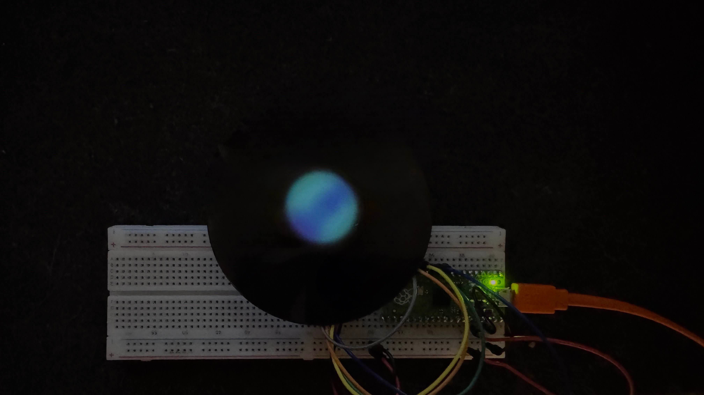

# tft-plasma-effect

Create an "animated" plasma effect on a round tft display.
This effect is motivated by the apple homepod.

<div align="center">
    
</div>

> TFT Display beneath homepod cover with built in diffuser.

Due to the limited cpu speed of the pi pico, the animation can currently be only described as a slide show unless the resolution is lowered considerably.
With a resolution of `8` or heigher (heigher is a lower resolution) it becomes actually quite fast.
Using a diffuser hides the _blocky_ look and makes everything smooth.

### Flash the pico

You can flash the firmware using the following command:

```
tinygo flash -target=pico .
```

### Read tty

There are hardly any logs, just when a frame finishes.
This can be either used to check uptime and see how many fps the display is running at.

```
tinygo monitor
```
