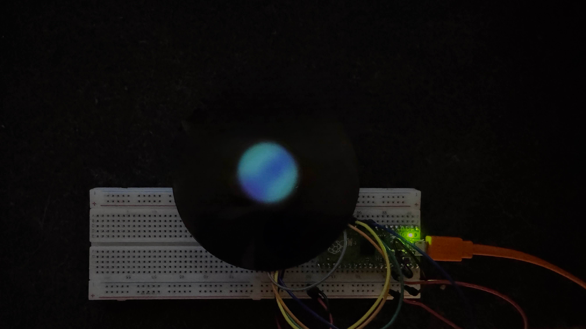

# tft-plasma-effect

Create an "animated" plasma effect on a round tft display.
This effect is motivated by the apple homepod.

<div align="center">
    
</div>

> TFT Display beneath homepod cover with built in diffuser.

The animation renders a reduced-resolution moving color field, expands it into larger display pixels, and streams the frame to the display in one address window.
Increase `renderScale` in `main.go` for more speed and larger pixels, or decrease it for smoother detail.

### Flash the pico

You can flash the firmware using the following command:

```
tinygo flash -target=pico .
```

### Read tty

There is no per-frame logging in the render loop.
Serial output is intentionally avoided because it slows the animation down.

```
tinygo monitor
```
